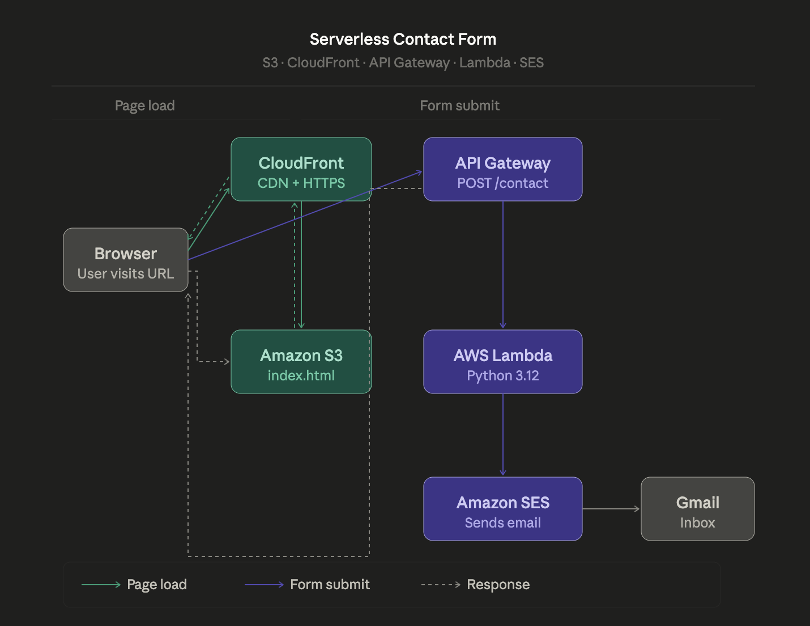

# AWS Serverless Contact Form

A serverless contact form built on AWS — no servers, scales automatically, costs $0/month.

## Live URL
https://d2basjk55rimpn.cloudfront.net

## Architecture
Browser → API Gateway → Lambda (Python) → SES → Gmail

## AWS Services
| Service | Role |
|---|---|
| Amazon S3 | Hosts the frontend |
| Amazon CloudFront | Global CDN + HTTPS |
| Amazon API Gateway | REST endpoint receiving form submissions |
| AWS Lambda | Processes form data and calls SES |
| Amazon SES | Sends email notification |

## Cost: $0 (AWS Free Tier)

## What I Learned
Building this taught me how the serverless model actually works in practice. 
S3 hosts the frontend, CloudFront delivers it securely over HTTPS, API Gateway 
receives the form submission and routes it to Lambda, Lambda processes the data 
and calls SES to send the email. No servers anywhere in that chain. 

The part that surprised me most was how simple the Lambda function actually is — 
about 30 lines of Python doing work that would have required a full backend server 
before. I also learned that CORS errors are real and that API Gateway needs to be 
configured carefully to allow the browser to talk to it.
